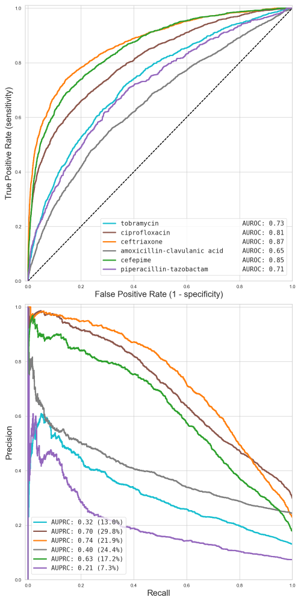

# Direct Antimicrobial Resistance Prediction from MALDI-TOF mass spectra profile in clinical isolates through Machine Learning

This code accompanies the paper &ldquo;Direct Antimicrobial Resistance Prediction from MALDI-TOF mass spectra profile in clinical isolates through Machine Learning&rdquo;
by Caroline Weis et al.

This repository is a work in progress. See below for some details about
how to reproduce some of the figures of our preprint and stay tuned for
more information!

# Installation

It is recommended to use [`poetry`](https://python-poetry.org) to
install and interact with the code provided in this repository. This
ensures that all required dependencies are installed correctly. If you
have installed `poetry`&nbsp;(using your local package manager or the
installation instructions on its official website), the following
commands are sufficient to install everything:

```shell
poetry install
poetry shell
```

# Example: plotting E. coli AMR prediction results

To reproduce a part of Figure 3 in the paper&nbsp;(*AUROC and AUPRC
curves for antimicrobial resistance prediction using logistic
regression*), it is sufficient to issue the following commands:

```shell
poetry shell # Not necessary if you are already in the virtual environment
python plot_fig4_curves_per_species_and_antibiotic_2panels.py
```

Afterwards, the output file `fig4.png` will be created, which reproduces
the E. coli panel of Figure 3 in the paper:



You can also call the script with the `--help` option, i.e. `python
plot_fig4_curves_per_species_and_antibiotic_2panels.py --help` in order
to see which other options are available.

# Example: creating performance tables

To get a glimpse of the performance of AMR prediction in certain
scenarios, the script `collect_results.py` can be used. In the absence
of a more complicated matching procedure, the script makes heavy use of
your shell's capabilities to list files. For example, to analyse all
results of all trained classifier for E. coli, use the following
commands:

```shell
poetry shell # Not necessary if you are already in the virtual environment
python collect_results.py ../results/fig4_curves_per_species_and_antibiotics/*/*Escherichia*
```

This will result in the following output:

```
                                                        accuracy       auprc      auroc
                                                            mean   std  mean  std  mean  std
species          antibiotic                  model
Escherichia coli Amoxicillin-Clavulanic acid lightgbm      77.06  0.82 43.83 1.83 67.02 1.41
                                             lr            75.93  0.76 40.96 2.86 65.81 1.41
                                             rf            75.71  0.15 41.13 1.29 66.27 1.76
                                             svm-linear    54.09 10.54 30.84 1.63 56.93 2.08
                                             svm-rbf       62.48 13.59 39.91 1.84 64.23 1.63
                 Cefepime                    lightgbm      88.99  0.63 69.85 2.90 88.17 1.47
                                             lr            87.54  0.82 63.18 3.07 85.59 1.22
                                             rf            84.91  0.41 66.99 2.65 86.92 1.75
                                             svm-linear    71.46 19.17 47.35 4.90 76.04 3.49
                                             svm-rbf       58.30 35.40 64.24 1.94 85.24 1.51
                 Ceftriaxone                 lightgbm      88.42  0.84 79.41 2.13 89.55 1.36
                                             lr            86.65  0.74 74.38 2.20 87.36 1.26
                                             rf            84.21  0.85 77.01 2.24 87.63 1.52
                                             svm-linear    77.61  2.04 61.04 3.26 79.17 2.31
                                             svm-rbf       83.68  1.70 74.83 2.03 86.81 1.43
                 Ciprofloxacin               lightgbm      82.20  1.02 77.61 1.59 85.32 0.94
                                             lr            79.56  1.14 70.58 2.14 81.00 1.27
                                             rf            77.67  0.74 75.65 1.93 84.25 1.54
                                             svm-linear    67.32  2.13 55.95 3.62 71.40 3.01
                                             svm-rbf       56.58 23.14 67.63 2.98 79.60 2.23
                 Piperacillin-Tazobactam     lightgbm      92.59  0.40 21.12 2.78 71.54 3.90
                                             lr            92.75  0.20 22.01 3.77 71.18 3.54
                                             rf            92.71  0.00 18.46 1.62 69.83 3.10
                                             svm-linear    87.55  0.88 16.41 3.69 66.77 3.32
                                             svm-rbf       38.76 41.48 26.42 5.10 70.77 3.81
                 Tobramycin                  lightgbm      87.10  0.70 35.21 3.78 75.05 2.90
                                             lr            87.13  0.64 32.68 3.87 73.14 2.97
                                             rf            86.99  0.00 35.25 3.34 74.12 2.93
                                             svm-linear    73.80  2.95 23.47 3.11 65.06 3.01
                                             svm-rbf       66.29 28.26 33.33 3.66 71.09 2.89
```

Feel free to experiment with other settings and other scenarios, the
script is quite 'smart' and supports different reporting types out of
the box.

# Contact

This code is developed and maintained by members of the [Machine Learning and
Computational Biology Lab](https://www.bsse.ethz.ch/mlcb) of [Prof. Dr.
Karsten Borgwardt](https://www.bsse.ethz.ch/mlcb/karsten.html) and the
[Applied Microbiology Lab](https://appliedmicrobiologyresearch.net/en/)
of [Prof. Dr. Adrian
Egli](https://biomedizin.unibas.ch/en/persons/adrian-egli):

- [Caroline Weis](https://weis.ml) ([GitHub](https://github.com/cvweis))
- [Bastian Rieck](https://bastian.rieck.me) ([GitHub](https://github.com/Pseudomanifold))
- [Aline Cuénod](https://biomedizin.unibas.ch/en/persons/aline-cuenod) ([GitHub](https://github.com/acuenod111))
